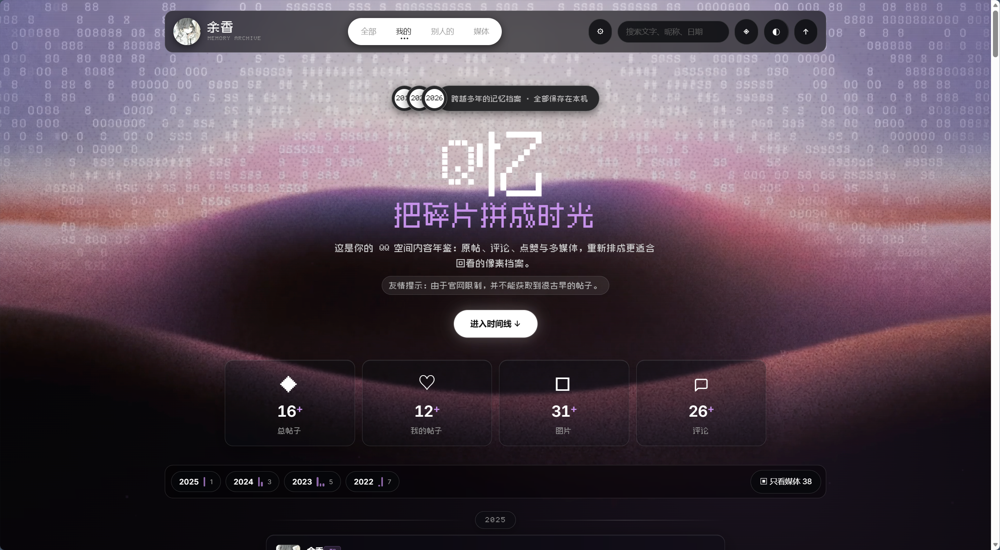
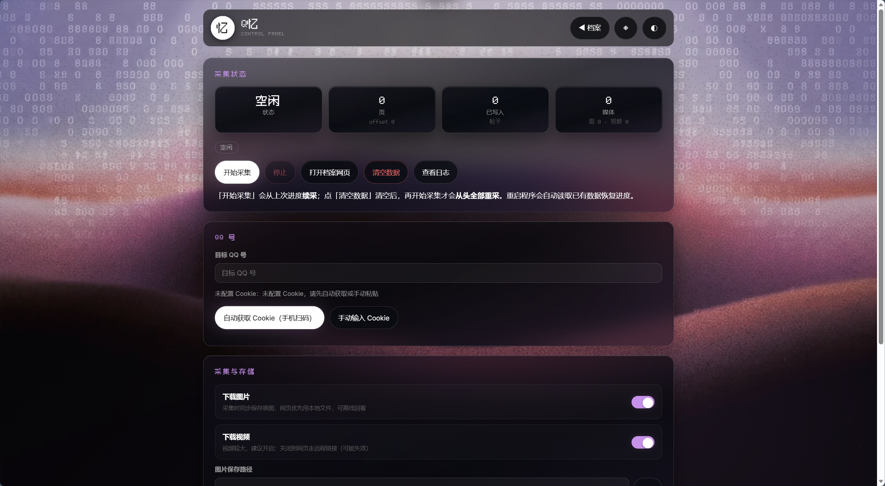

# QMemory-Q忆

这是你的 QQ 空间内容年鉴：原帖、评论、点赞与多媒体，重新排成更适合回看的像素档案。

> 友情提示：由于官网限制，并不能获取到很古早的帖子，例如有的账号只能获取到2019年。

## 特性

- **像素风网页查看器**：全部 / 我的 / 别人的(和别人有交互的帖子) / 相册墙四种视图，年份与月份筛选、全文搜索、主题配色
- **像素风控制台**：浏览器打开即用，开始 / 停止采集、实时进度、风控与采集完成提示、一键打开档案网页
- **Cookie 两种获取方式**：手机扫码登录自动获取；或手动粘贴完整 cookie 字符串 / curl 命令
- **媒体可选下载**：图片 / 视频开关，下载后网页优先使用本地文件，可离线回看；保存路径可自选
- **断点续采**：中断后从上次 offset 继续，不会重复写入
- **可采集有相关互动的 QQ 号**：目标空间可见即可，不限于自己的号
- **封控**：如果采集不到了可以打开空间看一下给不给数据，否则有可能是被检测了，不要担心等一会解封重新扫码换cookie就可以继续了(为了防止频繁出现这种问题已经加了随机延迟采集牺牲速度换取稳定)

## 快速开始

源码仓库：`git@github.com:zwh1213/QMemory.git`

```bash
git clone git@github.com:zwh1213/QMemory.git
cd QMemory
pip install -r requirements.txt
python main.py
```

启动后自动打开默认浏览器进入控制台页面：先扫码登录（或粘贴 Cookie），填好目标 QQ 号，点击「开始采集」。采集完成后点「打开档案网页」回看。

> **数据持续采集**：采集过程中查看数据显示不全属于正常现象，多图 / 评论 / 点赞等详情会在采集过程中自动补齐，全部采集完成即完整。

## 数据存储

所有数据保存在本地，不经过任何第三方服务器：

- `output/config.json` —— Cookie 与设置（由控制台生成）
- `output/datas/pc_cards.jsonl` —— 采集的帖子数据（路径可在控制台修改）
- `output/datas/crawl.log` —— 采集与下载日志
- `output/imgs`、`output/videos` —— 下载的图片 / 视频（路径可在控制台修改）

## 输出文件结构

```text
output/
├─ config.json        # Cookie / g_tk / 下载开关 / 三个保存路径
├─ datas/             # 帖子数据与进度（路径可在控制台修改）
│  ├─ pc_cards.jsonl  # 逐页写入的帖子卡片（可追加，断点续采）
│  ├─ pc_state.json   # 采集断点与进度状态
│  ├─ media_map.json  # 本地文件映射
│  └─ crawl.log       # 日志
├─ imgs/              # 下载的帖子图片（路径可在控制台修改）
└─ videos/            # 下载的帖子视频

output/details.json   # 详情补充（评论、点赞、转发等）
```

## 程序下载

Win10 / Win11 双击 `QMemory.exe` 即自动打开浏览器进入控制台，无需任何额外配置。

> **单文件说明**：`QMemory.exe`首次启动会解压依赖到系统临时目录并自动缓存；**第二次启动直接复用缓存，无需再次解压**，启动速度与普通程序一致。若系统清理了临时文件，则下一次启动会重新解压。
>
> 缓存路径为：系统临时目录 C:\Users\xxx\AppData\Local\Temp\

打包好的程序到 [GitHub Releases](https://github.com/zwh1213/QMemory/releases/latest) 页面下载：选一个版本，展开后点「Assets」下的 `QMemory.exe` 即可。

## 效果展示图





## 支持一下

如果这个项目对你有帮助，欢迎请开发者喝杯咖啡 ☕

<table>
  <tr>
    <td align="center"><br><b>微信</b></td>
    <td align="center"><br><b>支付宝</b></td>
  </tr>
</table>

## 免责声明

- 本项目仅供个人学习与存档使用，请勿用于任何商业或非法用途
- 采集内容版权归原作者所有，请尊重他人隐私
- 请遵守腾讯相关服务条款；使用本工具产生的一切后果由使用者自行承担

## 欢迎提供 Bug

如果你发现任何问题，或想提出改进建议，欢迎提 [Issue](https://github.com/zwh1213/QMemory/issues)。反馈时请附上控制台或网页的报错信息，以及操作步骤。
